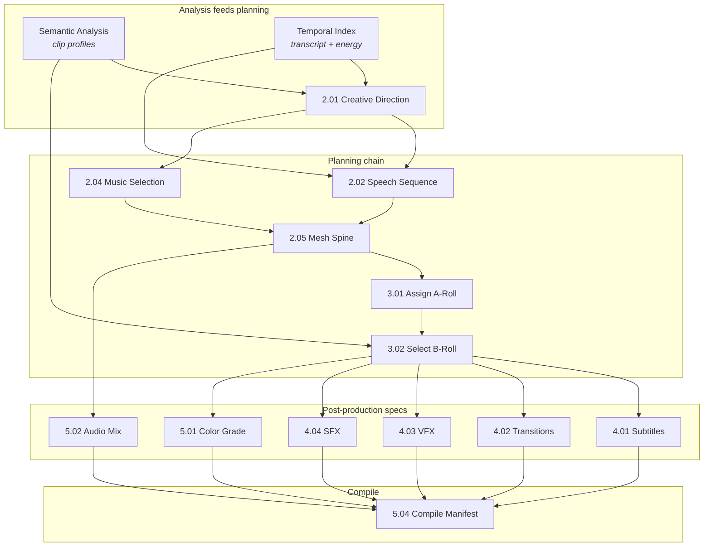

# Video Editing Pipeline — Master Reference

> [!IMPORTANT]
> This is the single source of truth for the entire automated video editing pipeline.
> It covers what's built, how it connects, and what runs where.

---

## Architecture Overview

The pipeline has three layers:

```
┌─────────────────────────────────────────────────────────────────┐
│  LAYER 1: ANALYSIS (Local — runs offline on MacBook)            │
│                                                                 │
│  Speech → WhisperX (MPS GPU)                                    │
│  Video  → Gemma4 12B 4-bit (MLX, Apple Silicon)                 │
│  SFX    → Audio Flamingo Next (MPS, int4) + librosa             │
│  Music  → madmom + essentia + allin1 + Demucs                   │
└──────────────────────────┬──────────────────────────────────────┘
                           │ structured JSON
                           ▼
┌─────────────────────────────────────────────────────────────────┐
│  LAYER 2: PLANNING (Antigravity — you are the LLM)              │
│                                                                 │
│  Creative Direction → reads analysis, infers style/mood          │
│  Speech Sequence    → orders speech segments into narrative      │
│  Music Selection    → picks track matching creative direction    │
│  Audio Spine        → meshes speech + music into timed structure │
│  A-Roll Assignment  → maps spine blocks to source clips          │
│  B-Roll Selection   → picks B-roll from vision analysis          │
│  Post-Production    → plans subtitles, transitions, VFX, SFX    │
│  Compile Manifest   → combines all specs into assembly manifest  │
└──────────────────────────┬──────────────────────────────────────┘
                           │ assembly_manifest.json
                           ▼
┌─────────────────────────────────────────────────────────────────┐
│  LAYER 3: EXECUTION (Local tools + DaVinci Resolve)             │
│                                                                 │
│  Resolve Assembly → Python timeline builder + Fusion            │
│  Subtitle Render  → Remotion (ProRes 4444 + alpha)              │
│  SFX Placement    → sfx_placer.py (scoring engine + Resolve API)│
└─────────────────────────────────────────────────────────────────┘
```

---

## Layer 1: Analysis (Local, Offline)

### 1A. Temporal Event Index — Step 1.04

This is the heaviest analysis step. It produces **10 distinct signal layers per clip**, all using signal processing (no LLM required). The implementation lives in [step.py](file:///Users/prajwal/Documents/life_stuff/plan%20of%20action/process%20design/library/steps/step_1_04_temporal_index/step.py).

| # | Signal | Tool | Resolution | What It Produces |
|---|---|---|---|---|
| 1 | **Scene boundaries** | ffmpeg scene filter | Per-frame | Visual cut/change points with confidence scores |
| 2 | **Speech regions** | WhisperX (faster-whisper + wav2vec2) | ±5-15ms per word | Transcript, word timestamps, confidence |
| 3 | **Energy curve** | librosa RMS | 30Hz (frame-aligned) | Normalized energy envelope + scipy peak detection |
| 4 | **Audio events** | torchaudio / librosa fallback | 2Hz | Silence, ambient noise classification |
| 5 | **Motion energy** | ffmpeg frame diff + numpy | 30Hz (frame-aligned) | Visual motion magnitude + peak/high-motion times |
| 6 | **Audio onsets** | librosa onset_detect | ~23ms | Transient hit times (snap points for SFX/cuts) |
| 7 | **Word end times** | Derived from speech | Per-word | Flat sorted array for cut-point snapping |
| 8 | **Optical flow direction** | ffmpeg + numpy block-matching | 5Hz | Per-sample (dx, dy, magnitude) + dominant motion classification |
| 9 | **Camera motion decomposition** | Derived from optical flow | 5Hz | Translation X/Y, zoom factor, residual |
| 10 | **Face presence** | OpenCV Haar cascade (or heuristic) | 5Hz | 0-1 face confidence + present/absent timestamps |

**Speech (WhisperX) technical details:**

| Property | Value |
|---|---|
| Transcription model | faster-whisper large-v3, int8, CTranslate2 |
| Transcription device | **CPU** (CTranslate2 has no MPS/Metal backend) |
| Alignment model | wav2vec2 (phoneme forced alignment) |
| Alignment device | **MPS** (Apple GPU — PyTorch does support MPS) |
| Word accuracy | ±5-15ms (vs ±200-500ms from native Whisper) |
| Onset snapping | Word starts snapped to nearest librosa onset within 30ms |
| Post-processing | Sanitizes wav2vec2 artifacts (overlaps, zero-duration, long words) |

**Key design decisions:**
- Energy + motion curves at **30Hz** — matches video frame rate for single-frame accuracy
- Word onset snapping gives **sub-frame precision** for consonant attacks
- Model caching across clips — WhisperX large-v3 takes ~3min to load, cached between clips

### 1B. Video Analysis — Gemma4 12B (MLX)

| Property | Value |
|---|---|
| Model | `mlx-community/gemma-4-12b-it-4bit` |
| Device | MLX (Apple Silicon unified memory) |
| RAM | ~8-9.3 GB peak |
| Speed | ~30-300s per clip depending on length |
| Script | [vision_pipeline_v3.py](file:///Users/prajwal/Documents/content_stuff/video_editing_pilot/library/tools/analysis/vision_pipeline_v3.py) |
| Guide | [local_video_analysis_guide.md](file:///Users/prajwal/Documents/content_stuff/video_editing_pilot/docs/architecture/local_video_analysis_guide.md) |
| Architecture | [vision_architecture.md](file:///Users/prajwal/Documents/content_stuff/video_editing_pilot/docs/architecture/vision_architecture.md) |
| Step | 1.03 Semantic Analysis |

**Dimension-indexed architecture (v3):**

Each annotation dimension uses its own optimal temporal indexing strategy:

| Dimension | Temporal Index | Input | What It Captures |
|---|---|---|---|
| 1. Scene | Event-driven (ffmpeg boundaries + model) | Video | Location, lighting, environment changes |
| 2. Camera | Event-driven (one-shot) | Video | Mode, framing, stability, movement |
| 3. Actions | Fixed 10s windows | Video clips + transcript | Physical actions, speech delivery, body language |
| 4. Objects + OCR | Entity-indexed, two-tier | Frames (coarse + detail) | Every person, vehicle, object, readable text |
| 5. Assessment | Clip-level hybrid | Video + deterministic | Content type, usable/unusable ranges |

**Key design principles:**
- **Objective annotation only** — describes observable facts, not inferences (mood/energy derived downstream by planning LLM)
- **Strict JSON output** — every model call produces structured data, with retry on parse failure
- **Right modality for the job** — video for temporal flow (actions, camera), frames for visual detail (objects, OCR)

**Output:** Per-clip JSON profile with dimension-indexed structured fields. See [vision_architecture.md](file:///Users/prajwal/Documents/content_stuff/video_editing_pilot/docs/architecture/vision_architecture.md) for full schema.

### 1C. SFX Library Analysis — Audio Flamingo Next + librosa

| Property | Value |
|---|---|
| Audio Model | `nvidia/audio-flamingo-next-captioner-hf` (int4 quantized) |
| Device | MPS (Apple GPU), ~5.6 GB VRAM |
| Speed | ~36-90s per file for full mode, instant for fast (librosa-only) |
| Script | [sfx_pipeline.py](file:///Users/prajwal/Documents/content_stuff/video_editing_pilot/library/tools/analysis/sfx_pipeline.py) |
| Query | [sfx_query.py](file:///Users/prajwal/Documents/content_stuff/video_editing_pilot/library/tools/analysis/sfx_query.py) |
| Guide | [sfx_analysis_guide.md](file:///Users/prajwal/Documents/content_stuff/video_editing_pilot/docs/architecture/sfx_analysis_guide.md) |
| Prerequisite | Runs once against the shared SFX library (not per-project) |

**7 analysis dimensions:**

| # | Dimension | Tool | What It Captures |
|---|---|---|---|
| 1 | Semantic Description | Audio Flamingo Next | Natural language description of the sound |
| 2 | Technical Properties | librosa | Duration, loudness, frequency content |
| 3 | Energy Profile | librosa | Attack time (ms), decay, envelope shape (ADSR) |
| 4 | Tonal vs Noise | librosa | Pitched or unpitched, fundamental frequency |
| 5 | Temporal Structure | librosa | One-shot vs multi-hit, number of events |
| 6 | Folder Category | File system | User-defined categories from folder names |
| 7 | Similarity Embedding | sentence-transformers | 384-dim vector in FAISS index |

**Why NOT CLAP:** CLAP zero-shot embeddings caused excessive false positives (confusing a low-frequency thunder sound with a metallic explosion). The AF-Next hybrid approach is significantly more accurate because it produces rich text descriptions that encode nuance.

**Why mood/use-case are excluded from indexing:** They're context-dependent — the same SFX can be "comedic" in one edit and "dramatic" in another. Mood is derived at edit time from technical + semantic data by the planning LLM.

**Apple Silicon patches required:**
1. Float64 → Float32 in `apply_rotary_time_emb` (MPS doesn't support fp64)
2. Audio padding to 30s (Whisper encoder expectation)
3. Input dtype casting (processor outputs fp32, model runs fp16)

**Current status:** 26/74 files fully profiled (AF-Next descriptions). All 74 have technical features. Pipeline supports resume — running again picks up where it left off.

### 1D. Music Analysis — madmom + essentia + allin1

| Component | Tool | What It Produces |
|---|---|---|
| **BPM / Tempo** | madmom (RNN + DBN) | ±0.5-1 BPM accuracy, tempo tracking over time |
| **Beat grid** | madmom | Every beat + downbeat timestamp |
| **Musical key** | essentia KeyExtractor | Key + mode (e.g., A minor), ~70-80% accuracy |
| **Chord progression** | madmom DeepChromaChord | Per-beat chord labels (A:min, D:maj, etc.) |
| **Song structure** | allin1 | Intro, verse, chorus, bridge, outro segmentation |
| **Stem separation** | Demucs (Meta) | Isolated vocals, drums, bass, accompaniment |
| **Energy/drops** | librosa onset_strength + scipy | Build/drop moments in the track |

> [!NOTE]
> NOT all of these are implemented yet. The current `music_analysis.json` in pipeline_output uses a subset. madmom for BPM/beats and librosa for energy are the ones actively used. The full stack is designed and researched.

**Why NOT librosa for BPM:** librosa has ±2-5 BPM accuracy and frequent octave errors (doubling/halving the BPM). madmom is significantly more reliable.

---

## Layer 2: Planning (Antigravity — LLM-Driven)

These steps run through conversation with Antigravity (Gemini). The LLM reads structured analysis output and makes creative/editorial decisions. Each step has a [handoff.md](file:///Users/prajwal/Documents/life_stuff/plan%20of%20action/process%20design/library/steps) or `bridge.py` that defines the prompt format and expected output.

### Step Flow



### What Each Planning Step Does

| Step | Type | Input | Output | Description |
|---|---|---|---|---|
| **2.01 Creative Direction** | LLM handoff | Vision analysis + transcript | `creative_direction` | Infers mood, energy, pacing style, visual language from raw footage analysis |
| **2.02 Speech Sequence** | LLM + script | Transcript + creative direction | `speech_sequence` | Selects hook, orders body segments, marks excluded passages. Script validates timing. |
| **2.04 Music Selection** | LLM handoff | Creative direction | `music_selection` | Picks a background music track matching mood/energy. Helper scripts download. |
| **2.05 Mesh Spine** | LLM + script | Speech sequence + music + transcript | `timed_spine` | Creates the master audio timeline — speech blocks meshed with music. Script validates durations. |
| **3.01 Assign A-Roll** | Script only | Timed spine + clip catalog | `a_roll_assignments` | Deterministic: maps each spine block to its source clip timecodes |
| **3.02 Select B-Roll** | LLM + script | A-roll + vision analysis + creative direction | `b_roll_assignments` | LLM picks visually appropriate B-roll for each segment |
| **4.01 Plan Subtitles** | Script only | Timed spine + transcript | `subtitle_plan` | Generates subtitle groups (word clustering, emphasis marking) |
| **4.02 Plan Transitions** | LLM + script | Shot list + creative direction | `transition_spec` | LLM designs transition type per cut (dissolve, hard cut, etc.) |
| **4.03 Plan VFX** | LLM + script | Shot list + creative direction + vision analysis | `enhancement_spec` | LLM specifies zoom keyframes, film grain, glow effects |
| **4.04 Plan SFX** | LLM + script | Timed spine + creative direction + vision analysis | `sfx_spec` | LLM places SFX *intentions* (what event, what type, what mood). Actual file selection is handled by `sfx_placer.py`'s scoring engine. |
| **5.01 Color Grade** | Script only | Creative direction + shot list | `color_grade_spec` | Generates Resolve color grade node specifications |
| **5.02 Audio Mix** | Script only | Timed spine + music + creative direction | `audio_mix_spec` | Generates track-level automation (ducking, fades, music volume curves) |
| **5.04 Compile Manifest** | Script only | All specs above | `assembly_manifest.json` | Combines everything into the final assembly instruction set |

### Data Store

All planning outputs accumulate in [pipeline_data.json](file:///Users/prajwal/Documents/content_stuff/post%20a%20day%20keeps%20the%20apple%20away/001/pipeline_data.json) (138KB for project 001). This is the full state of every editorial decision.

---

## Layer 3: Execution (Local Tools + DaVinci Resolve)

### 3A. Timeline Assembly

| Property | Value |
|---|---|
| Script | Python timeline builder (`resolve_full_assembly.py`) |
| Step | 6.01 Render |
| Requires | DaVinci Resolve running on Edit page |

Connects to Resolve via `DaVinciResolveScript`, places clips on timeline tracks, imports Fusion compositions for transitions/VFX, sets clip properties.

### 3B. Subtitle & Motion Graphics Rendering — Remotion

| Property | Value |
|---|---|
| Engine | Remotion (Node.js) |
| Output | ProRes 4444 with alpha channel (transparent overlay) |
| Resolution | 1080×1920 (vertical) |
| Components | Karaoke word-by-word animation, upper-third title card, progress bar, accent shapes |
| Script | [run_pipeline.py](file:///Users/prajwal/Documents/content_stuff/video_editing_pilot/library/processes/edit_video/run_pipeline.py) (render phase) |
| Source | `remotion-subtitles/src/` |

### 3C. SFX Placement — Scoring Engine

| Property | Value |
|---|---|
| Script | [sfx_placer.py](file:///Users/prajwal/Documents/content_stuff/video_editing_pilot/library/tools/execution/sfx_placer.py) (57KB) |
| Requires | DaVinci Resolve running, SFX library indexed |

**Placement strategy:**
- **Multi-track architecture**: SFX Hits, SFX Whoosh, SFX Riser, SFX Ambience (separate tracks prevent overlap)
- **Onset-aligned timing**: The "hit" or loudest transient lands exactly on the cut frame, not the start of the audio file. Calculated as: `placement_frame = event_frame - (sfx_onset_offset × fps)`
- **5-dimensional semantic scoring**: Matches SFX files to timeline events using acoustic features + description similarity
- **Cut weight scoring**: High-importance cuts get layered sound design (riser + whoosh + impact), minor cuts get subtle whoosh or nothing
- **Speech gap awareness**: Shifts SFX peaks into natural dialogue pauses within ±0.5s of the cut
- **Beat-snapping**: Aligns SFX to nearest beat from music analysis when appropriate
- **Density budgets**: Prevents over-saturation by limiting SFX per time window

**Known issues:**
- Volume ducking notes are informational only — never actually applied to clips
- B-roll entries/exits on V2 are ignored (only V1 cuts detected)
- Impact sounds with long tails (>3s) need duration filtering

---

## File Map

### Repository Structure (video_editing_pilot)

```
video_editing_pilot/
├── docs/architecture/            ← Architecture documentation
│   ├── pipeline_master_reference.md
│   ├── pipeline_quickstart.md
│   ├── vision_architecture.md
│   ├── local_video_analysis_guide.md
│   └── sfx_analysis_guide.md
├── library/
│   ├── steps/                    ← 28 step definitions with manifests (27 wired into the DAG, 26 selected by default)
│   │   ├── step_0_01_validate_sfx_library/   ← Pre-flight SFX index check
│   │   ├── step_1_01_scan_project/
│   │   ├── step_1_02_catalog_footage/
│   │   ├── step_1_03_semantic_analysis/      ← Gemma4 vision (MLX)
│   │   ├── step_1_04_temporal_index/         ← WhisperX + signal processing
│   │   ├── step_1_05_prosody_analysis/       ← Parselmouth prosody
│   │   ├── step_1_06_object_segmentation/    ← Not wired into the DAG
│   │   ├── step_1_07_ocr_extraction/         ← Not wired into the DAG
│   │   ├── step_2_01_creative_direction/
│   │   ├── step_2_02_speech_sequence/
│   │   ├── step_2_04_music_selection/
│   │   ├── step_2_05_mesh_spine/
│   │   ├── step_2_06_music_analysis/         ← Per-project beat/BPM/key
│   │   ├── step_3_01_assign_aroll/
│   │   ├── step_3_02_select_broll/
│   │   ├── step_3_03_review_rough_cut/       ← Quality gate
│   │   ├── step_4_01_plan_subtitles/
│   │   ├── step_4_02_plan_transitions/
│   │   ├── step_4_03_plan_vfx/
│   │   ├── step_4_04_plan_sfx/
│   │   ├── step_4_05_render_subtitles/       ← Remotion ProRes 4444
│   │   ├── step_4_06_render_motion_graphics/
│   │   ├── step_5_01_color_grade/
│   │   ├── step_5_02_audio_mix/
│   │   ├── step_5_03_creative_cohesion/
│   │   ├── step_5_04_compile_manifest/
│   │   ├── step_6_01_render/                 ← Python timeline builder + Fusion
│   │   │   ├── generate_fusion_lua.py         ← Fusion Lua scripts
│   │   │   ├── resolve_full_assembly.py       ← Resolve orchestrator
│   │   │   └── resolve_orchestrator.py        ← Lower-level Resolve bridge
│   │   └── step_6_02_validate_output/
│   ├── tools/
│   │   ├── analysis/                         ← Analysis tools
│   │   │   ├── vision_pipeline_v3.py         ← Gemma4 12B video analysis
│   │   │   ├── sfx_pipeline.py               ← SFX profiling (AF-Next + librosa)
│   │   │   ├── sfx_query.py                  ← FAISS SFX search interface
│   │   │   ├── music_pipeline.py             ← Beat/BPM/key analysis
│   │   │   └── speech_advanced_pipeline.py   ← Prosody (parselmouth)
│   │   └── execution/                        ← Execution tools
│   │       ├── generate_subtitle_props.py    ← Remotion input props
│   │       └── sfx_placer.py                 ← SFX scoring + placement
│   ├── processes/edit_video/
│   │   ├── dag.json                          ← 26-node DAG, 92 edges
│   │   ├── manifest.json                     ← Process-level manifest
│   │   └── run_pipeline.py                   ← DAG execution engine
│   └── schema/                               ← JSON schemas
├── remotion-subtitles/                       ← Remotion project
│   └── src/
│       ├── SubtitleOverlay.tsx
│       └── Root.tsx
└── tests/
    └── test_pipeline.py
```

---

## What's Built vs What's Designed

| Component | Status | Notes |
|---|---|---|
| WhisperX speech analysis | ✅ Built + tested | In step 1.04 temporal index |
| Gemma4 vision analysis (v3) | ✅ Built | Dimension-indexed, repo-relative |
| AF-Next SFX profiling | ✅ Built, 35% indexed | 26/74 files, resume-capable |
| librosa technical SFX features | ✅ Built, 100% indexed | All 74 files |
| FAISS semantic search | ✅ Built + tested | sfx_query.py query interface |
| Remotion subtitle rendering | ✅ Built + tested + wired | Step 4.05, ProRes 4444 overlays |
| Remotion motion graphics | ✅ Built + tested | Title card, progress bar |
| sfx_placer.py scoring engine | ✅ Built + tested | 11 clips placed in test run |
| Fusion .comp generator | ✅ Built | Animated VFX, transitions |
| Fusion Lua generation | ✅ Built | Subtitle keyframes via clipboard |
| Music analysis pipeline | ✅ Built + wired | Step 2.06, BPM/key/beat grid |
| SFX library validation | ✅ Built + wired | Step 0.01, pre-flight check |
| Review rough cut gate | ✅ Built + wired | Step 3.03, quality gate |
| Pipeline data accumulation | ✅ Done for 001 | pipeline_data.json complete |
| DAG definition | ✅ Created | 24 nodes, 58 edges, validated |
| Step manifests | ✅ Created | 24/24 manifests |
| Prosody analysis | ✅ Built + wired | Step 1.05, parselmouth |
| Pipeline runner | ✅ Built | run_pipeline.py with state injection |
| madmom tempo/beats | 📐 Designed | In music_pipeline.py (needs deps) |
| essentia key detection | 📐 Designed | In music_pipeline.py (needs deps) |
| allin1 song structure | 📐 Designed | In music_pipeline.py (needs deps) |
| Demucs stem separation | 📐 Designed | In music_pipeline.py (needs deps) |
| Orchestrator end-to-end run | ✅ Built + wired | `manage_project.py run` drives all 26 DAG steps through to an exported file (step 6.01 renders, 6.02 validates it) |
| Volume ducking on SFX clips | ❌ Not implemented | Notes generated but never applied |
| B-roll SFX events | ❌ Not implemented | Only V1 cuts detected |

---

## How a Full Run Works Today

The supported path is the orchestrator: `python3 manage_project.py run <slug>`
runs the DAG end to end and ends in an exported file (see the README for the
CLI). The manual sequence below predates it and is kept only for running a
single layer by hand:

### Preflight — Analysis (automated, local)
```bash
# 1. Transcribe all clips
cd video_testing && python3 run_pipeline.py --skip-resolve --skip-import

# 2. Analyze all clips visually
cd video_analysis_docs && python3 vision_pipeline_v3.py --raw-dir ../raw

# 3. Index SFX library (one-time)
cd video_analysis_docs && python3 sfx_pipeline.py --sfx-dir "/path/to/sfx library"
```

### Phase 2 — Planning (conversational, with Antigravity)
You paste analysis results into Antigravity and work through each planning step. Outputs accumulate in `pipeline_data.json`.

### Phase 3 — Execution (automated, needs Resolve open)
```bash
# 4. Render subtitle overlays
cd video_testing && python3 run_pipeline.py

# 5. Place SFX on timeline
cd video_testing && python3 sfx_placer.py

# 6. Assembly in Resolve is done via the Python timeline builder and Fusion
```

---

## Research References

These conversation artifacts contain the deep technical research behind the pipeline (stored in Antigravity conversation history):

| Doc | Conversation | What It Covers |
|---|---|---|
| programmatic_audio_for_video_editing.md | `2dfe11db` | Python audio libraries, FFmpeg, AI music gen |
| audio_metadata_deep_dive.md | `2dfe11db` | Maximum-fidelity speech, music, quality extraction |
| sfx_planning_and_placement.md | `2dfe11db` | Sound design framework, UCS taxonomy, placement math |
| workflow_and_implications.md | `2dfe11db` | Three-phase workflow, what becomes possible |
| sfx_analysis_dimensions.md | `2dfe11db` | 9 dimensions mapped to tools |
| vision_pipeline_plan.md | `b29a87a6` | Local Gemma4 as video editing "eyes" |
| final_verdict.md | `b29a87a6` | Local vs cloud comparison across 8 clips |
