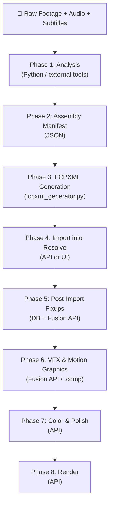

# DaVinci Resolve: Programmatic Control Reference

> Based on hands-on reverse engineering of Resolve Studio v21 on macOS.  
> Project: `001_Final` — vertical short-form (1080×1920, 30fps).

---

## Part 1: Can We Reverse Engineer the Blob?

### The Problem
The `EffectFiltersBA` blob in the SQLite database stores **all Inspector parameters** for Basic Titles (position, font, size, color, stroke, alignment). It's a proprietary binary format. If we could decode it, we'd have full programmatic control over every edit parameter.

### What We Know

```
Blob Structure:
Offset  Size  Content
──────  ────  ──────────────────────────────────────
0-3     4B    Version: 00 00 00 02 (constant)
4-7     4B    Payload length (BE uint32 = blob_size - 8)
8-13    6B    Magic: 81 28 b5 2f fd 60
14+     var   Payload (216-241 bytes for titles)
```

### Definitive Compression Proof

We performed a **controlled 1-pixel experiment**: changing only the Y position from 557 → 558.

| Metric | Value |
|---|---|
| Parameter changed | Position Y: 557 → 558 (1 pixel) |
| Blob size change | 241 → 240 bytes (shrunk by 1!) |
| Bytes that differ | **152 of 240 (63%)** |
| Diff pattern | Cascading — changes at offset 7, then 16, then 39-50, then 65-66, then 80-107, then scattered throughout |

> [!IMPORTANT]
> A 1-pixel change causes **63% of the blob to change** with no predictable byte-offset mapping. This proves the payload uses **stream compression with cascading dependencies** — like LZ77/deflate where changing one token shifts the entire output. You cannot poke a byte to change a value.

### Decompression Attempts (All Failed)

| Algorithm | Result |
|---|---|
| zlib (all wbits) | ❌ |
| gzip | ❌ |
| lzma / xz | ❌ |
| bz2 | ❌ |
| zstd | ❌ |
| LZ4 (frame + block) | ❌ |
| brotli | ❌ |
| snappy | ❌ |
| Raw protobuf | ❌ (field numbers are nonsensical) |
| IEEE 754 float scan | ❌ (no known values found at any offset) |

### Is Reverse Engineering Feasible?

**Theoretically yes, practically very hard.** Here's what it would take:

| Approach | Feasibility | Effort |
|---|---|---|
| **Binary analysis of `fusionscript.so`** | The 6.7MB shared library contains the serialization code. Disassembling it (IDA/Ghidra) and finding the compress/decompress functions for the `81 28 b5` magic is the most direct path. | Weeks of RE work. Requires strong x86/ARM disassembly skills. |
| **Controlled differential corpus** | Generate 100+ blobs with systematic single-parameter changes (Y=100, Y=200, ... Y=900). Look for statistical patterns in the compressed output. | Days. Requires many manual Resolve interactions or automated UI scripting. |
| **Runtime hooking** | Attach a debugger to Resolve, set breakpoints on the serialization function, capture the uncompressed parameter buffer before it enters the compressor. | Hours if you can find the right function. Requires SIP disabled on macOS. |
| **Fusion .setting comparison** | The Fusion page uses plain-text Lua `.setting` files. The Edit page uses the binary blob. They both encode the same data. Compare a Text+ `.comp` export with the equivalent Edit page blob to find the mapping. | Days. Requires matching parameter sets between both systems. |

> [!WARNING]
> Even if decoded, Blackmagic could change the format in any update. The Fusion API is the supported path — it's stable across versions and doesn't require RE.

### Verdict on Blob RE
The blob is compressed with a **custom Blackmagic algorithm** (not any standard format). Reverse engineering the `fusionscript.so` binary is the only reliable path to cracking it. For most use cases, the **Fusion API on Text+ titles** gives equivalent control without needing to touch the blob.

---

## Part 2: Full Editing Capability Matrix

For each editing technique, we evaluate what's possible across all methods.

### Legend
- ✅ **Full** — Can reproduce programmatically with high fidelity
- ⚠️ **Partial** — Possible with workarounds or limitations
- ❌ **Not possible** — Cannot be done programmatically
- 🔧 **Method** — Which tool(s) to use

---

### Assembly & Structure

| Technique | Can We Do It? | How | Notes |
|---|---|---|---|
| **Rough cut / assembly edit** | ✅ Full | FCPXML | Define V1 clips with source in/out points, timeline positions. Frame-accurate. |
| **Multi-track timeline** | ✅ Full | FCPXML | V1 spine + connected clips on lanes. Tested with V1 (A-Roll), V2 (B-Roll), V3 (Subtitles), A1 (Music), A2 (Dialog). |
| **Insert / overwrite edits** | ✅ Full | FCPXML + DB | FCPXML for initial layout; DB for post-import timing adjustments. |
| **Clip reordering** | ✅ Full | FCPXML or DB | Regenerate FCPXML with new order, or update `Start` in DB. |
| **Clip trimming** | ✅ Full | FCPXML or DB | Source in/out in FCPXML; `Start`/`Duration` in DB. |
| **Track naming** | ⚠️ Partial | API | `SetTrackName("video", 1, "A-Roll")` works via Fusion API. FCPXML doesn't control it. |

---

### Transitions

| Technique | Can We Do It? | How | Notes |
|---|---|---|---|
| **Cross dissolve** | ✅ Full | FCPXML | `<transition name="Cross Dissolve">` with duration and offset. Proven working. |
| **Dip to black** | ✅ Full | FCPXML | Same transition element with different effect ref. |
| **Wipe / Iris / Push** | ⚠️ Partial | FCPXML | Need correct `.motr` effect UID. Resolve ships many transition types but you need to find each one's UID. |
| **Custom GPU transitions** | ❌ | — | Requires OFX plugins or Fusion comps, can't be specified in FCPXML. |
| **Variable-duration transitions** | ✅ Full | FCPXML | Duration is a parameter on the transition element. |

---

### Text & Titles

| Technique | Can We Do It? | How | Notes |
|---|---|---|---|
| **Basic subtitle overlay** | ✅ Full | FCPXML + DB | FCPXML creates titles with text/font/size/color. DB blob-clone for position. |
| **Per-subtitle positioning** | ✅ Full | Fusion API | Text+ titles with `SetInput("Center", {x, y})`. Requires Text+ (not Basic Titles). |
| **Animated text (typewriter, etc.)** | ✅ Full | Fusion API / .comp | Text+ supports keyframed animations via Fusion nodes. Generate `.comp` files with animated inputs. |
| **Per-word styling** | ✅ Full | Fusion API | `StyledText` supports rich text with per-character formatting. |
| **Lower thirds / name cards** | ✅ Full | Fusion API | Full control over position, background, animation via Fusion composition. |
| **Scrolling credits** | ⚠️ Partial | Fusion API | Keyframe the `Center.Y` over time. More complex than a built-in scroll. |

---

### Visual Effects (VFX)

| Technique | Can We Do It? | How | Notes |
|---|---|---|---|
| **Keyframed scale (Ken Burns)** | ✅ Full | FCPXML | `<adjust-transform>` with `<keyframeAnimation>` on scale. Proven working. |
| **Keyframed position/rotation** | ✅ Full | FCPXML | Same mechanism, different parameters. |
| **Speed ramp / time remap** | ⚠️ Partial | FCPXML | `<timeMap>` element exists in FCPXML spec. Needs testing with Resolve import. |
| **Picture-in-picture** | ✅ Full | FCPXML + Fusion API | Connected clip on a lane with scale/position transform. |
| **Green screen / chroma key** | ⚠️ Partial | Fusion API | Add a `ChromaKeyer` or `DeltaKeyer` node to a Fusion composition. Requires Text+-like Fusion clip. |
| **Rotoscoping** | ❌ | — | Requires frame-by-frame masking. Resolve's Magic Mask is AI-driven and not scriptable. The API has `CreateMagicMask()` but results are unpredictable. |
| **Motion tracking** | ❌ | — | Resolve's tracker analyzes footage frame-by-frame. No API to create tracked data programmatically. `Stabilize()` exists but is analysis-based. |
| **Blur / glow / drop shadow** | ✅ Full | Fusion API / .comp | Add `Blur`, `Glow`, `Shadow` nodes in a Fusion composition. Fully parameterizable. |
| **Color correction / grading** | ⚠️ Partial | API + LUT | `SetLUT()` applies a LUT file. `SetCDL()` sets CDL values. `GetNodeGraph()` for Color page nodes. Full node-based grading requires Resolve UI. |
| **LUT application** | ✅ Full | API | `item.SetLUT(nodeIndex, lutPath)` — proven API method. |
| **Stabilization** | ⚠️ Partial | API | `item.Stabilize()` triggers analysis. You can't set stabilization parameters, just trigger it. |
| **Lens correction** | ❌ | — | Not exposed via API. |

---

### Motion Graphics

| Technique | Can We Do It? | How | Notes |
|---|---|---|---|
| **Animated lower thirds** | ✅ Full | Fusion API / .comp | Build a Fusion composition with `TextPlus` + `Background` + `Merge` + keyframed transforms. Export as `.comp` template, generate per-clip. |
| **Logo overlay / watermark** | ✅ Full | Fusion API | Add a `Loader` node (image) merged over the clip. Position/scale via `Center`/`Size` inputs. |
| **Shape animations** | ✅ Full | Fusion API / .comp | Fusion has `Rectangle`, `Ellipse`, `Polygon` mask/shape tools. All keyframeable. |
| **Particle effects** | ✅ Full | Fusion API / .comp | Fusion's `pEmitter`, `pRender` nodes. Complex but fully parameterizable in .comp Lua. |
| **3D text** | ⚠️ Partial | Fusion API | Fusion has 3D space tools. Complex to set up programmatically. |

---

### Audio

| Technique | Can We Do It? | How | Notes |
|---|---|---|---|
| **Music track placement** | ✅ Full | FCPXML | `<asset-clip>` with `<adjust-volume>` for level control. |
| **Volume adjustment (dB)** | ✅ Full | FCPXML | `<adjust-volume amount="-18.0"/>` |
| **Audio fade in/out** | ⚠️ Partial | FCPXML | Volume keyframes via `<keyframeAnimation>` on the volume param. Needs testing. |
| **Beat-matched edits** | ⚠️ Partial | FCPXML + external | Detect beats externally (librosa/madmom), generate cut points, feed to FCPXML generator. Resolve has no beat-detection API. |
| **SFX placement** | ✅ Full | FCPXML | Additional `<asset-clip>` elements on audio lanes. Same as music placement. |
| **Audio ducking** | ⚠️ Partial | FCPXML | Keyframed volume on music track timed to dialog. Must calculate duck points externally. |
| **Voice isolation** | ⚠️ Partial | API | `item.SetVoiceIsolationState()` / `GetVoiceIsolationState()` — binary toggle only. |
| **Audio EQ / effects** | ❌ | — | Fairlight audio effects are not exposed via API. |

---

### Advanced Editing Techniques

| Technique | Can We Do It? | How | Notes |
|---|---|---|---|
| **Match cuts** | ⚠️ Partial | FCPXML + external | Analyze footage externally (CV/AI) to find matching compositions, then program cut points in FCPXML. Resolve has no "find matching frame" API. |
| **J-cuts / L-cuts** | ✅ Full | FCPXML | Set audio and video in/out points independently. Audio lane extends before/after video clip. |
| **Jump cuts** | ✅ Full | FCPXML | Simply remove sections from source media (gaps in source_in/out). |
| **Montage sequences** | ✅ Full | FCPXML | Rapid clip assembly with short durations. Add transitions between. |
| **Split screen** | ✅ Full | Fusion API / .comp | Multiple `Merge` nodes with `Center` offset and `Crop` masks. |
| **Freeze frame** | ✅ Full | FCPXML | Set a clip's duration longer than its source range with speed=0 or use a generator. |
| **Slow motion / fast motion** | ⚠️ Partial | FCPXML | `<timeMap>` or speed attributes. Needs testing. Optical flow retiming requires Resolve processing. |
| **Reverse playback** | ⚠️ Partial | FCPXML | Speed = -1. Needs testing with Resolve import. |
| **Compound clips** | ⚠️ Partial | API | `CreateCompoundClip()` exists but requires selected clips in UI. |
| **Multicam editing** | ❌ | — | Multicam clip creation is UI-only. |

---

### Color & Look

| Technique | Can We Do It? | How | Notes |
|---|---|---|---|
| **Apply LUT** | ✅ Full | API | `item.SetLUT(1, "/path/to/lut.cube")` |
| **CDL correction** | ✅ Full | API | `item.SetCDL({"Slope": "1 1 1", "Offset": "0 0 0", ...})` |
| **Export/import grades** | ⚠️ Partial | API | `item.ExportLUT()`, `item.CopyGrades([targets])`. Grade presets via `.drx` files. |
| **Node-based grading** | ⚠️ Partial | API | `GetNodeGraph()`, `GetNumNodes()`, `GetNodeLabel()` — can read but limited write access. |
| **Color match between clips** | ❌ | — | Resolve's color matching is visual/AI-driven. |

---

### Project Management

| Technique | Can We Do It? | How | Notes |
|---|---|---|---|
| **Create project** | ✅ Full | API | `pm.CreateProject("name")` |
| **Set resolution / frame rate** | ✅ Full | API | `proj.SetSetting("timelineResolutionWidth", "1080")` — proven. |
| **Create timeline** | ✅ Full | API | `mp.CreateEmptyTimeline("name")` or `ImportTimelineFromFile()` |
| **Import media** | ✅ Full | API | `mp.ImportMedia(["/path/to/file.mov"])` |
| **Render / export** | ✅ Full | API | `proj.AddRenderJob()`, `proj.StartRendering()` |
| **Timeline export (FCPXML/AAF)** | ✅ Full | API | `tl.Export("/path.fcpxml", resolve.EXPORT_FCPXML_1_10)` |

---

## Part 3: End-to-End Production Workflow

Here's how you actually build a video from raw footage to finished export using this pipeline.

### Phase Overview



---

### Phase 1: Analysis (External Tools)

**Input:** Raw footage files, audio, transcript/subtitles  
**Output:** Structured data (JSON) describing all edit decisions

This happens OUTSIDE Resolve. Use Python libraries to:

| Task | Tool | Output |
|---|---|---|
| Detect beats in music | `librosa` / `madmom` | Beat timestamps for cut points |
| Transcribe speech | Whisper / your subtitle pipeline | Subtitle entries with start/end times |
| Analyze shot composition | OpenCV / CLIP | Match-cut candidates |
| Plan B-roll timing | Manual or AI | B-roll in/out points on timeline |
| Detect silence/pauses | `librosa.effects.split()` | Jump cut points |

---

### Phase 2: Assembly Manifest (JSON)

**Input:** Analysis data  
**Output:** `assembly_manifest.json`

Create a structured JSON manifest that describes the entire edit:

```json
{
  "project": {
    "name": "My Video",
    "resolution": [1080, 1920],
    "frame_rate": 30,
    "duration_seconds": 69.8
  },
  "tracks": {
    "V1": {
      "clips": [
        {
          "source_file": "/path/to/footage.MOV",
          "source_in": 3.5, "source_out": 7.0,
          "timeline_in_frame": 0, "timeline_out_frame": 105
        }
      ]
    },
    "V2": { "clips": ["... B-roll ..."] },
    "A2": { "clips": ["... music ..."] }
  },
  "transitions": [
    { "cut_point_timeline": 3.5, "duration_frames": 15, "type": "cross_dissolve" }
  ],
  "vfx": [
    { "timeline_start": 0, "params": { "scale_start": 1.0, "scale_end": 1.05 } }
  ]
}
```

Subtitles go in a separate JSON (from your subtitle pipeline step).

---

### Phase 3: FCPXML Generation

**Input:** `assembly_manifest.json` + `subtitles.json`  
**Output:** `timeline.fcpxml`

```bash
python fcpxml_generator.py assembly_manifest.json subtitles.json -o timeline.fcpxml
```

The generator handles:
- V1 spine clips with source media references and in/out points
- V2 B-roll as connected clips (`lane="1"`)
- V3 Basic Title subtitles with text/font/size/color (`lane="2"`)
- A1 dialog audio from V1 sources (`lane="-1"`)
- A2 music as asset-clips (`lane="4"`)
- Cross dissolve transitions between V1 clips
- Ken Burns keyframed scale transforms

> [!NOTE]
> FCPXML can express clips, audio, transitions, text content, and basic transforms. It CANNOT set title position, apply Fusion VFX, or control per-parameter styling.

---

### Phase 4: Import into Resolve

**Input:** `timeline.fcpxml`  
**Output:** Fully assembled timeline in Resolve

Two options:

**Option A — Via API (fully automated):**
```python
resolve = dvr.scriptapp("Resolve", "192.168.12.246")
pm = resolve.GetProjectManager()
proj = pm.CreateProject("My Video")
proj.SetSetting("timelineResolutionWidth", "1080")
proj.SetSetting("timelineResolutionHeight", "1920")
mp = proj.GetMediaPool()
mp.ImportTimelineFromFile("/path/to/timeline.fcpxml")
```

**Option B — Via UI:**
File → Import Timeline → From File → Select `.fcpxml`

At this point you have all clips, audio, transitions, and subtitles on the timeline with correct timing. Titles are centered (no lower-third position yet).

---

### Phase 5: Post-Import Fixups (DB + API)

**Input:** Imported timeline with centered subtitles  
**Output:** Subtitles repositioned to lower third

**Step 5a — Position one subtitle manually:**
Select any subtitle on V3 → open Inspector → drag it to the lower third position.

**Step 5b — Clone position to all subtitles via DB:**
```python
# Save & close project
pm.SaveProject(); pm.CloseProject(proj)

# Clone the template blob
conn = sqlite3.connect(DB_PATH)
template = conn.execute(
    "SELECT EffectFiltersBA FROM Sm2TiItem WHERE Sm2TiItem_id = ?", (template_id,)
).fetchone()[0]

conn.execute("""
    UPDATE Sm2TiItem SET EffectFiltersBA = ?
    WHERE DbType = 'Sm2TiGenerator' AND Sm2TiItem_id != ?
""", (template, template_id))
conn.commit()

# Reopen
proj = pm.LoadProject("My Video")
```

All 69 subtitles now have identical lower-third positioning.

> [!TIP]
> You can skip Step 5a if you've saved a reference blob from a previous project. Keep a library of blob templates for different positions/styles.

---

### Phase 6: VFX & Motion Graphics (Fusion API)

**When you need more than what FCPXML provides.** This phase is optional — skip it for simple edits.

**For per-subtitle VFX (glow, animated position, etc.):**

Approach: Create Text+ titles on an empty track, then move them via DB.

```python
# 1. Insert Text+ titles on a new empty track (V4)
#    (Do this BEFORE adding clips to avoid ripple damage)
for sub in subtitles:
    tl.SetCurrentTimecode(frame_to_tc(sub['start']))
    item = tl.InsertFusionTitleIntoTimeline("Text+")
    
    comp = item.GetFusionCompByIndex(1)
    tools = comp.GetToolList(False, "TextPlus")
    tool = list(tools.values())[0]
    
    # Set all parameters
    tool.SetInput("StyledText", sub['text'])
    tool.SetInput("Center", {1: 0.5, 2: 0.2})
    tool.SetInput("Size", 0.05)
    tool.SetInput("Font", "Inter")
    
    # Add VFX: e.g. drop shadow, glow
    # (via Fusion node graph manipulation)

# 2. Fix timing + move to V3 via DB
# (save, close, update Start/Duration/Track, reopen)
```

**For clip-level VFX (blur, keying, overlays):**

```python
# Generate a .comp file (plain-text Lua)
comp_content = '''
Composition {
    Tools = {
        Loader1 = Loader { Inputs = { Clip = "/path/to/overlay.png" } },
        Blur1 = Blur { Inputs = { XBlurSize = 5.0 } },
        Merge1 = Merge { Inputs = {
            Foreground = Input { SourceOp = "Loader1" },
            Background = Input { SourceOp = "MediaIn1" }
        }}
    }
}
'''
# Import onto a Fusion clip
item.ImportFusionComp("/path/to/effect.comp")
```

---

### Phase 7: Color & Polish (API)

```python
# Apply a LUT to all V1 clips
for item in tl.GetItemListInTrack("video", 1):
    item.SetLUT(1, "/path/to/look.cube")

# Or apply CDL values
item.SetCDL({
    "Slope": "1.1 1.0 0.9",
    "Offset": "0.01 0.0 -0.01",
    "Power": "1.0 1.0 1.0",
    "Saturation": "1.2"
})
```

---

### Phase 8: Render (API)

```python
proj.SetCurrentRenderFormatAndCodec("mp4", "H265_NVIDIA")
proj.SetRenderSettings({
    "TargetDir": "/path/to/output",
    "CustomName": "final_export"
})
proj.AddRenderJob()
proj.StartRendering()

# Monitor progress
while proj.IsRenderingInProgress():
    status = proj.GetRenderJobStatus(0)
    print(f"Progress: {status.get('CompletionPercentage', 0)}%")
    time.sleep(5)
```

---

### Workflow Decision Tree

| What you need | Skip to |
|---|---|
| Basic timeline with subtitles and music | Phases 1→4 (FCPXML only) |
| + Lower third subtitle positioning | + Phase 5 (DB blob clone) |
| + Custom VFX per subtitle | + Phase 6 (Fusion API) |
| + Color grading | + Phase 7 (LUT/CDL via API) |
| + Automated export | + Phase 8 (Render API) |
| Simple re-edit (change cut points) | Regenerate manifest → Phase 3→4 |
| Style change (font/position) | Phase 5 only (new blob template) |

---

## Summary: What's Realistic Today

### Tier 1: Fully Automatable (high fidelity)
- Timeline assembly (rough cut → fine cut)
- Subtitle creation and styling (via Text+ / Fusion API)
- Music / SFX placement with volume
- Transitions (dissolve, dip to black)
- Ken Burns / keyframed transforms
- Lower thirds and motion graphics (via Fusion .comp)
- LUT application
- J-cuts / L-cuts
- Beat-matched edits (with external beat detection)
- Project management and rendering

### Tier 2: Partially Automatable (needs workarounds)
- Per-subtitle arbitrary positioning (Text+ only, not Basic Titles)
- Speed ramps and slow motion
- Color grading (LUT/CDL only, not node-based)
- Audio ducking (manual calculation)
- Match cuts (external CV analysis needed)
- Green screen keying (Fusion API, complex)

### Tier 3: Not Automatable
- Rotoscoping / Magic Mask
- Motion tracking
- Audio EQ / Fairlight effects
- Multicam editing
- Lens correction
- Full node-based color grading
- Optical flow retiming

---

## Troubleshooting: Scripting Server Connection

The scripting server (`fuscript`) is notoriously finicky. Here's every failure mode and fix.

### Symptoms
- `dvr.scriptapp("Resolve")` returns `None`
- `dvr.scriptapp("Resolve", "192.168.12.246")` returns `None`
- `dvr.pinghosts()` returns `{}` (empty)

### Root Causes & Fixes

| Problem | How to Check | Fix |
|---|---|---|
| **fuscript not running** | `pgrep -fl fuscript` shows nothing | **Quit Resolve fully (Cmd+Q) and relaunch.** Toggling the preference doesn't restart fuscript. |
| **Scripting preference not set** | Check Resolve → Preferences → System → General → "External scripting using" | Set to **"Local"**. Then Cmd+Q and relaunch. |
| **Wrong IP address** | `dvr.pinghosts()` returns different IP than you're using | Use the IP from `pinghosts()`. It changes with WiFi/network. Run `ipconfig getifaddr en0` to check. |
| **Using localhost** | `dvr.scriptapp("Resolve")` or `dvr.scriptapp("Resolve", "127.0.0.1")` | In Resolve v21+, you **must use the LAN IP**, not localhost. |
| **Too early after launch** | fuscript takes 5-10 seconds to bind port 1144 after Resolve starts | Wait and retry. Add `time.sleep(10)` after detecting Resolve launch. |
| **Port conflict** | `lsof -i :1144` shows another process | Kill the conflicting process. |
| **config.dat not persisted** | Cat `~/Library/Preferences/Blackmagic Design/DaVinci Resolve/config.dat` and grep for `System.Scripting.Mode` | If missing, set it in Resolve UI. The pref file is only written on clean quit. |

### Reliable Connection Snippet
```python
import sys, os, time
os.environ["RESOLVE_SCRIPT_API"] = "/Library/Application Support/Blackmagic Design/DaVinci Resolve/Developer/Scripting"
os.environ["RESOLVE_SCRIPT_LIB"] = "/Applications/DaVinci Resolve/DaVinci Resolve.app/Contents/Libraries/Fusion/fusionscript.so"
sys.path.insert(0, os.environ["RESOLVE_SCRIPT_API"] + "/Modules")
import DaVinciResolveScript as dvr

def connect_resolve(max_retries=5):
    for attempt in range(max_retries):
        hosts = dvr.pinghosts()
        if hosts:
            ip = list(hosts.values())[0].get('IP', '')
            resolve = dvr.scriptapp("Resolve", ip)
            if resolve:
                return resolve
        print(f"Retry {attempt+1}/{max_retries}...")
        time.sleep(3)
    raise ConnectionError("Cannot connect to Resolve scripting server")

resolve = connect_resolve()
```

---

## Environment Reference

| Item | Value |
|---|---|
| Resolve version | Studio v21.0.0b.0028 |
| OS | macOS (arm64) |
| Python | 3.14.4 |
| DB path | `~/Pictures/Davinci/Resolve Projects/Users/guest/Projects/001_Final/Project.db` |
| fusionscript.so | `/Applications/DaVinci Resolve/DaVinci Resolve.app/Contents/Libraries/Fusion/fusionscript.so` (6.7MB) |
| Scripting modules | `/Library/Application Support/Blackmagic Design/DaVinci Resolve/Developer/Scripting/Modules` |
| Scripting server port | 1144 (`fuscript` service) |
| Connection | `dvr.scriptapp("Resolve", "192.168.12.246")` — must use LAN IP |
| Config key | `System.Scripting.Mode = 1` in `~/Library/Preferences/Blackmagic Design/DaVinci Resolve/config.dat` |

### Key Files
- [fcpxml_generator.py](file:///Users/prajwal/Documents/content_stuff/video_editing_pilot/library/steps/step_6_01_render/fcpxml_generator.py) — FCPXML assembly generator
- [re_toolkit.py](file:///Users/prajwal/Documents/content_stuff/video_editing_pilot/library/steps/step_6_01_render/drp_exports/re_toolkit.py) — DB snapshot/diff toolkit
- Exported .comp template: `drp_exports/textplus_template.comp`
